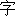

# 配色方案

Unifont可能以各种配色方案分发，例如GNU官方的位图配色方案是“**白色为`0`，黑色为`1`**”，而Minecraft使用的配色方案是“**透明为`0`，白色为`1`**”。

本项目提供了一些常用的配色方案的支持，便于创作Unifont。目前支持的配色方案有：

| 配色方案名 | 前景色 | 背景色 | 示例图片 |
| --- | --- | --- | --- |
| `black_and_white` | 黑色 | 白色 | |
| `inverted_black_and_white` | 白色 | 黑色 | |
| `transparent_and_white` | 白色 | 透明 |  |
| `transparent_and_black` | 黑色 | 透明 |  |

## `ColorScheme` 类

本项目提供了`ColorScheme` 类，用于传递一致的配色方案。

一般而言，本项目中可以指定配色方案的地方，都可以传入`str`或`ColorScheme`类型。

```python
>>> from unicode_utils import ColorScheme
>>> scheme = ColorScheme("black_and_white")
>>> glyph.load_img("path/to/glyph.png", color_scheme=scheme)
```
